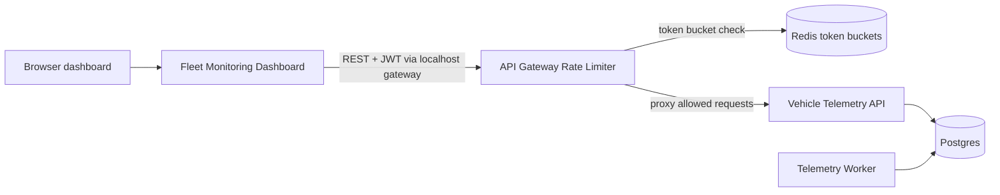

# DriveOps: Vehicle Telemetry Platform

DriveOps is a production-shaped vehicle telemetry platform inspired by OEM/Tier-1 engineering workflows: ingest vehicle events, inspect fleet state, enforce authenticated access, protect APIs with rate limiting, and expose operational health/metrics.

This repo ties together three separate projects:

- `vehicle-telemetry-api`: FastAPI backend, Postgres, Alembic migrations, seed data, JWT auth, role checks, and ingestion worker
- `fleet-monitoring-dashboard`: React + TypeScript dashboard for fleet inventory and telemetry inspection
- `api-gateway-rate-limiter`: FastAPI gateway with Redis-backed token bucket rate limiting, proxying, headers, health checks, and metrics

The integrated stack is designed for reproducible local evaluation: the dashboard talks to the gateway, and the gateway proxies to the telemetry API, so normal UI usage exercises authentication, persistence, rate limiting, observability, and failure handling.

## What This Proves

- A real browser UI can authenticate and inspect vehicle telemetry.
- API traffic flows through a gateway before reaching the backend.
- Protected routes require JWT auth and role-aware backend checks.
- Data is persisted in Postgres and initialized through migrations plus seed data.
- Redis-backed token buckets enforce rate limits and return standard rate-limit headers.
- The gateway exposes health and Prometheus-style metrics.
- The full system can be started, verified, and reset from this orchestration repo.

## Architecture



## How to use:

`make up` starts:

- Dashboard container
- Gateway container
- Redis container
- Telemetry API container
- Telemetry worker container
- Postgres container
- One-shot telemetry init container

The init container runs:

```bash
alembic upgrade head
python -m app.seed
```

That creates the schema and demo login/data.

## Prerequisites

- Docker Desktop running
- `make`
- `curl`
- `python3`
- The three sibling repos present at these default paths:
  - `../Vehicle Telemetry API/vehicle-telemetry-api`
  - `../Fleet Monitoring Dashboard/fleet-monitoring-dashboard`
  - `../api-gateway-rate-limiter/api-gateway-rate-limiter`

If your repos live somewhere else, override the Compose build contexts:

```bash
TELEMETRY_API_CONTEXT=/path/to/vehicle-telemetry-api
DASHBOARD_CONTEXT=/path/to/fleet-monitoring-dashboard
GATEWAY_CONTEXT=/path/to/api-gateway-rate-limiter
```

## First Run

From this folder:

```bash
cp .env.example .env
make up
```

Then, in another terminal:

```bash
make smoke
```

Open the dashboard:

```text
http://localhost:15173
```

Login:

```text
username: admin
password: password123
```

## URLs

The integrated stack uses collision-resistant ports so it can run beside the standalone repos.

| Service | URL |
| --- | --- |
| Dashboard | `http://localhost:15173` |
| Gateway | `http://localhost:18080` |
| Gateway metrics | `http://localhost:18080/metrics` |
| Telemetry API | `http://localhost:18000` |
| Telemetry API docs | `http://localhost:18000/docs` |
| Postgres | internal only: `postgres:5432` |
| Redis | internal only: `redis:6379` |

Override host ports in `.env`:

```bash
DASHBOARD_HOST_PORT=15173
GATEWAY_HOST_PORT=18080
API_HOST_PORT=18000
```

## Common Commands

```bash
make up       # build and start the whole stack
make down     # stop containers
make build    # build all images
make ps       # show container state
make logs     # follow all logs
make health   # check telemetry API and gateway health
make metrics  # print gateway Prometheus metrics
make smoke    # run end-to-end portfolio smoke checks
make reset    # stop containers and remove volumes
```

Use `make reset` when you want a clean database and fresh seed data.

## Verify The Stack

Run the full smoke check:

```bash
make smoke
```

The smoke check verifies:

- Dashboard responds on the configured dashboard port.
- Telemetry API health returns `ok`.
- Gateway health returns `ok` and Redis is reachable.
- Unauthenticated access to protected vehicle routes returns `401`.
- Gateway responses include rate-limit headers.
- Login works through the gateway.
- Authenticated vehicle fetch returns the seeded Ford F-150.
- Gateway metrics include `gateway_requests_total`.

Manual checks are still useful during a walkthrough.

Check the API directly:

```bash
curl http://localhost:18000/api/v1/health
```

Check the gateway:

```bash
curl http://localhost:18080/health
```

Check gateway metrics:

```bash
curl http://localhost:18080/metrics
```

Unauthenticated requests to protected API routes should return `401` through the gateway:

```bash
curl -i http://localhost:18080/api/v1/vehicles
```

Log in through the gateway:

```bash
curl -X POST http://localhost:18080/api/v1/auth/login \
  -H "Content-Type: application/json" \
  -d '{"username":"admin","password":"password123"}'
```

Use the returned token:

```bash
TOKEN=<paste-token-here>

curl http://localhost:18080/api/v1/vehicles \
  -H "Authorization: Bearer $TOKEN"
```

Expected seed vehicle:

```json
[
  {
    "id": 1,
    "vin": "1FTFW1RG0PFA12345",
    "make": "Ford",
    "model": "F-150",
    "year": 2024
  }
]
```

## Interview Demo Path

Use [docs/demo-checklist.md](docs/demo-checklist.md) for a 3-5 minute walkthrough.

Short version:

1. Run `make smoke`.
2. Open `http://localhost:15173`.
3. Sign in with `admin / password123`.
4. View the vehicle list.
5. Open the seeded Ford F-150.
6. Inspect telemetry summary, ECUs, signals, and event timeline.
7. Show `make metrics`.
8. Optionally demo rate limiting and failure behavior.

The dashboard is built with:

```bash
VITE_API_BASE_URL=http://localhost:18080/api/v1
```

That means browser traffic goes:

```text
Dashboard -> Gateway -> Telemetry API -> Postgres
```

## Demo The Rate Limiter

Default gateway limit:

```text
60 requests per 60 seconds per client IP
```

To force an easy demo, lower the limit in `.env`:

```bash
RATE_LIMIT_CAPACITY=5
RATE_LIMIT_WINDOW_SECONDS=60
```

Restart:

```bash
make down
make up
```

Then send repeated requests:

```bash
for i in {1..10}; do curl -i http://localhost:18080/health; done
```

For proxied API routes, use a token and repeat a protected request. A rate-limited response returns `429` plus headers like:

```text
X-RateLimit-Limit
X-RateLimit-Remaining
X-RateLimit-Reset
Retry-After
```

## Demo Failure Behavior

Stop Redis to show gateway fail-closed behavior:

```bash
docker compose stop redis
curl -i http://localhost:18080/api/v1/vehicles
```

Expected behavior:

```text
503 redis_unavailable
```

Restart Redis:

```bash
docker compose start redis
```

Stop the telemetry API to show upstream failure behavior:

```bash
docker compose stop telemetry-api
curl -i http://localhost:18080/api/v1/health
```

Expected behavior is a gateway upstream error such as `502` or `504`, depending on timing.

Restart the API:

```bash
docker compose start telemetry-api
```

## Logs

Follow everything:

```bash
make logs
```

Follow only gateway logs:

```bash
docker compose logs -f gateway
```

Follow only telemetry API logs:

```bash
docker compose logs -f telemetry-api
```

## CI

The top-level integration workflow validates Compose configuration, checks out the three sibling repos, starts the full stack, and runs `make smoke`.

The individual product repos still own their own unit/build CI:

- Backend API tests and Postgres integration tests
- Dashboard lint/build
- Gateway route, proxy, and rate limiter tests

## Troubleshooting

If a port is already in use, change it in `.env`:

```bash
DASHBOARD_HOST_PORT=15174
GATEWAY_HOST_PORT=18081
API_HOST_PORT=18001
```

If login fails, reset the database and reseed:

```bash
make reset
make up
```

If the dashboard loads but API calls fail, confirm the gateway is healthy:

```bash
curl http://localhost:18080/health
```

If gateway health is OK but protected routes fail, confirm login works through the gateway:

```bash
curl -X POST http://localhost:18080/api/v1/auth/login \
  -H "Content-Type: application/json" \
  -d '{"username":"admin","password":"password123"}'
```

If containers look stale after changing code in a sibling repo:

```bash
docker compose build --no-cache
make up
```

## Repo Ownership

This repo only orchestrates the stack. Product code still lives in the individual repos:

- Backend/API changes go in `vehicle-telemetry-api`.
- Dashboard changes go in `fleet-monitoring-dashboard`.
- Gateway/rate-limiter changes go in `api-gateway-rate-limiter`.
